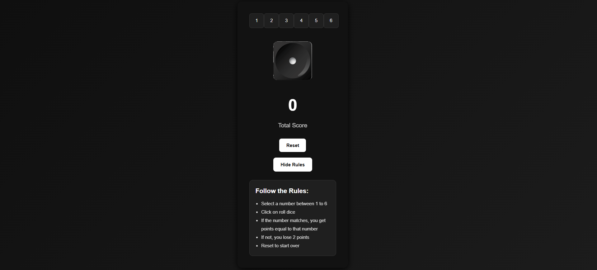

# 🎲 Dice Game 🎮

A sleek, modern, and minimalistic Dice Game built with **React** — styled with a dark UI theme inspired by Netflix, Google, and other professional web platforms.

## 📸 Demo



## 🚀 Features

- 🎲 Roll a dice between **1-6**
- 🖱️ Select a number before rolling
- ✅ If selected number matches the dice, you earn points
- ❌ If not, you lose 2 points
- 🔄 Reset game anytime
- 📜 Show/Hide game rules
- ⚡ Smooth, responsive and dark-themed modern UI

## 🛠️ Tech Stack

- **React JS**
- **Vite**
- **Custom CSS (dark, minimalistic theme)**

## 📦 Installation

```bash
git clone https://github.com/yourusername/dice-game.git
cd dice-game
npm install
npm run dev
